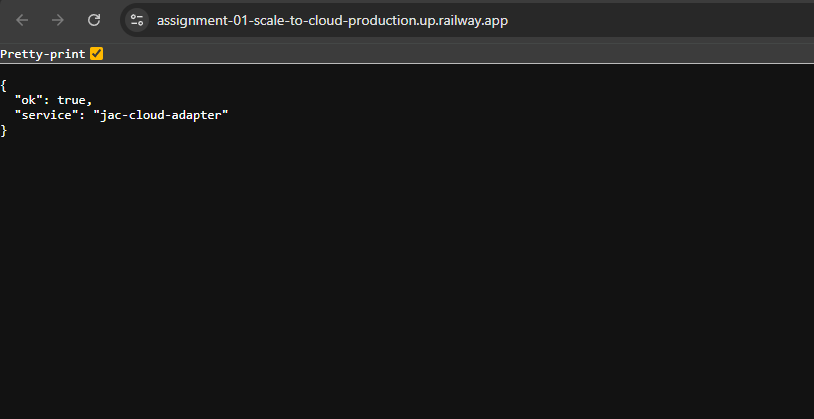
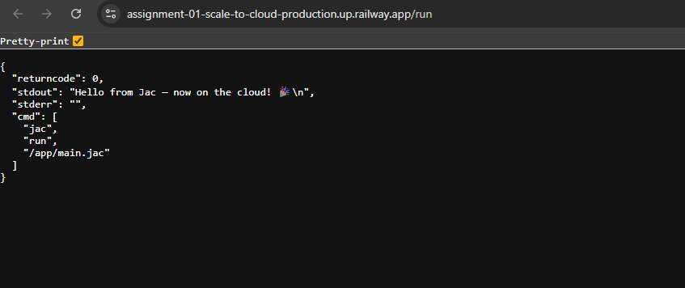
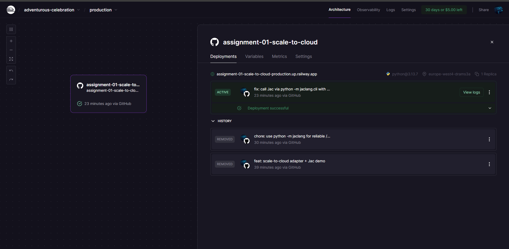

# Assignment 01: Scale to Cloud 

This project demonstrates how to **expose an unchanged Jac program as an HTTP service** and deploy it to the cloud. A tiny FastAPI wrapper calls `jac run main.jac` without modifying the core Jac code.

-----

##  Project Structure

```bash
assignment-01-scale-to-cloud/
├─ main.jac             # Guessing game (unchanged for cloud)
├─ app.py               # Tiny FastAPI adapter → runs `jac run main.jac`
├─ requirements.txt     # jaclang, fastapi, uvicorn
├─ Procfile             # Start command for Railway/Render
├─ .gitignore
└─ docs/
   └─ screenshots/
      ├─ railway-health.png
      ├─ railway-run.png
      └─ railway-dashboard.png
```

-----

##  Live Demo

The live service is available at:
`https://assignment-01-scale-to-cloud-production.up.railway.app`

### Endpoints

  * **GET /**: A **health check** endpoint.
    ```json
    { "ok": true, "service": "jac-cloud-adapter" }
    ```
  * **GET /run**: **Runs the Jac program** and returns its standard output/error.
    ```json
    {
      "returncode": 0,
      "stdout": "Secret: 57 Guess: 72 Hint: LOWER\n",
      "stderr": "",
      "cmd": [
        "jac",
        "run",
        "/app/main.jac"
      ]
    }
    ```
  * **GET /run?guess=15**: This endpoint is the same as `/run`, but it accepts an optional **`guess` query parameter**. The API captures this parameter and forwards it to the Jac program via an environment variable, without changing the core Jac file.

-----

##  Getting Started

### Run Locally (Step-by-Step)

1.  **Create and activate a virtual environment:**
    ```bash
    python3.12 -m venv .venv
    source .venv/bin/activate
    ```
2.  **Install dependencies:**
    ```bash
    python -m pip install -U pip -r requirements.txt
    ```
3.  **Run Jac locally** (sanity check, no web service):
    ```bash
    jac run main.jac
    ```
4.  **Start the HTTP service:**
    ```bash
    uvicorn app:app --host 0.0.0.0 --port 8000
    ```

Once the service is running, open your browser to test the endpoints:

  * [http://localhost:8000/](https://www.google.com/search?q=http://localhost:8000/)
  * [http://localhost:8000/run](https://www.google.com/search?q=http://localhost:8000/run)
  * [http://localhost:8000/run?guess=42](https://www.google.com/search?q=http://localhost:8000/run%3Fguess%3D42)

**Troubleshooting:** If the `jac` command is not found, ensure your virtual environment is active and `jaclang` is installed by running:
`source .venv/bin/activate && pip install jaclang && which jac`

### Deploy to Railway (Cloud)

1.  Push your repository to GitHub.
2.  In **Railway**, create a **New Project** and select **Deploy from GitHub**. Choose this repository.
3.  If prompted for a **Start command**, use:
    ```bash
    uvicorn app:app --host 0.0.0.0 --port $PORT
    ```
4.  After the deployment is complete, go to **Service** → **Settings** → **Generate Domain** to get a public URL for your service.
    Test the `/`, `/run`, and `/run?guess=...` endpoints on your new domain.

-----

##  How It Works

This project functions as a simple **adapter**. The FastAPI application (`app.py`) serves as a bridge, accepting HTTP requests and executing the Jac program (`main.jac`) in a subprocess.  The output from the Jac program is captured and returned as an HTTP response. For reliability, the adapter tries two commands:

```python
# The adapter uses this for reliability
[sys.executable, "-m", "jaclang.cli.cli", "run", "main.jac"] # robust
["jac", "run", "main.jac"]                                   # PATH fallback
```

This ensures the service works even if `jac` is not exposed in the host's `PATH`.

-----

##  Troubleshooting

  * **`jac: command not found`**: Activate your virtual environment and install `jaclang`.
  * **`No module named jaclang.__main__`**: The adapter is designed to handle this by using `python -m jaclang.cli.cli` as a fallback.
  * **`Railway says “Unexposed service”`**: You need to generate a public domain in **Service** → **Settings**.
  * **`502 / crash`**: Check the deployment logs in **Railway** → **Deployments** for specific error details.

-----

##  Screenshots

<p align="center"\> \ \</p\>
<p align="center"\> \ \</p\>
<p align="center"\> \ \</p\>

-----

##  Why This Meets "Scale to Cloud"

1.  The core **Jac program is unchanged**.
2.  A minimal **HTTP adapter** exposes the Jac program as a web service.
3.  The service is successfully **deployed to a public URL** and is fully functional.

🤫 Silence
This is an open-source project, so feel free to use it, fork it, and modify it as you see fit. Contributions are welcome!
Denis