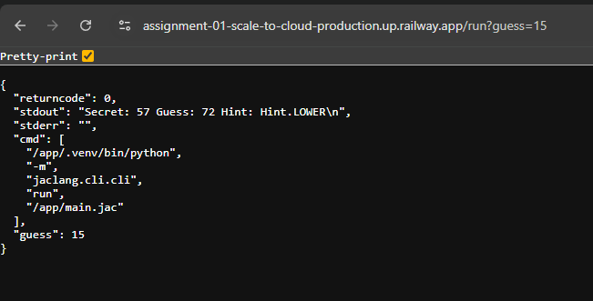

# Assignment 01 — Scale to Cloud

Expose an **unchanged Jac program** as an **HTTP service** and deploy it to the cloud.  
> The Jac code stays the same. We only add a tiny HTTP layer (FastAPI) that calls `jac run main.jac`.

---

## Demo

**Live service:** `https://assignment-01-scale-to-cloud-production.up.railway.app`  
- **Health:** `/` → returns service status  
- **Run Jac:** `/run` → executes `jac run main.jac` and returns output  

<b>Expected responses</b> (click)

**GET /**  

{ "ok": true, "service": "jac-cloud-adapter" }

GET /run

{
  "returncode": 0,
  "stdout": "Hello from Jac — now on the cloud! 🎉\n",
  "stderr": "",
  "cmd": ["jac", "run", "/app/main.jac"]
}

Project structure

assignment-01-scale-to-cloud/
├─ main.jac            # your unchanged Jac program
├─ app.py              # small FastAPI wrapper that runs main.jac
├─ requirements.txt    # deps for local + cloud
├─ Procfile            # how to start the service on Railway/Render
└─ .gitignore
Run locally (step-by-step)
bash

# 1) Create & activate venv
python3.12 -m venv .venv
source .venv/bin/activate

# 2) Install dependencies
python -m pip install -U pip -r requirements.txt

# 3) Quick sanity: run Jac locally (no web)
jac run main.jac

# 4) Start the HTTP service
uvicorn app:app --host 0.0.0.0 --port 8000
Open locally:

http://localhost:8000/

http://localhost:8000/run

If jac isn’t found, your venv isn’t active or jaclang isn’t installed.
Fix: source .venv/bin/activate && pip install jaclang && which jac.

Deploy to Railway (cloud)
Push this repo to GitHub.

Railway → New Project → Deploy from GitHub → select this repo.

If asked, Start command:

uvicorn app:app --host 0.0.0.0 --port $PORT
After deploy: Service → Settings → Generate Domain to get a public URL.

Test /<nothing> and /run on your domain.

Robust call if PATH is quirky:

# in app.py
p = subprocess.run([sys.executable, "-m", "jaclang.cli", "run", "main.jac"], ...)

How it works (one picture)

flowchart LR
  A[main.jac (Jac code)] -->|jac run| B[Local execution]
  A -->|called by| C[FastAPI app.py]
  C -->|/run endpoint| B
  C --> D[Railway Cloud]
  D --> E[Public URL]

Troubleshooting
jac: command not found → activate venv / install jaclang in it.

No module named jaclang.__main__ → use python -m jaclang.cli run main.jac.

Unexposed service → Service Settings → Generate Domain.

502 / crash → Railway Deployments → View logs.

Screenshots

  
 
  

Why this meets “Scale to Cloud”
1. Jac program is unchanged.
2. HTTP service wraps the Jac entrypoint.
3. Deployed to a public cloud URL with working / and /run.
